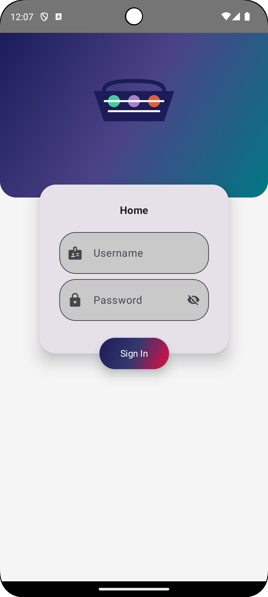
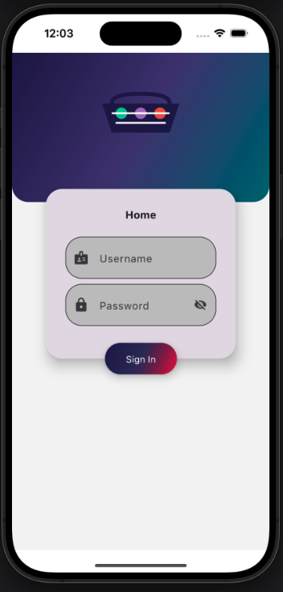
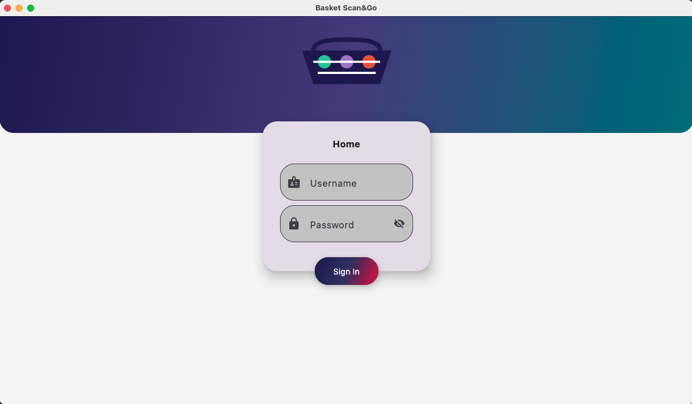
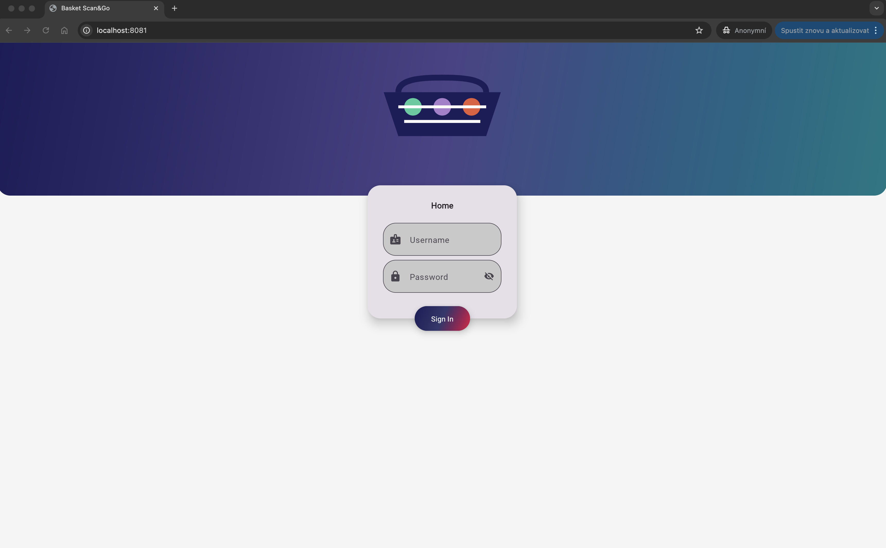

# Basket Scan and Go

[](https://kotlinlang.org)


## Project Overview

Basket Scan and Go is a cross-platform shopping application that allows customers to scan products, add them to a virtual basket, and check out without waiting in line. The application is built using Kotlin Multiplatform and Compose Multiplatform, enabling a shared codebase across Android, iOS, Desktop, and Web platforms.

### Key Features

- **Product Scanning**: Scan product barcodes to add items to your basket
- **Basket Management**: Create, view, and modify shopping baskets
- **User Authentication**: Secure login and user management
- **Shared Baskets**: Option to share baskets with other users
- **Cross-Platform**: Works on Android, iOS, Desktop, and Web

## Libraries used
- 🧩 [Compose Multiplatform](https://github.com/JetBrains/compose-multiplatform); for shared UI
- 🌐 [Ktor](https://github.com/ktorio/ktor); for networking
- 📦 [Kotlinx Serialization](https://github.com/Kotlin/kotlinx.serialization); for content negotiation
- 🕰️ [Kotlinx Datetime](https://github.com/Kotlin/kotlinx-datetime); for datetime
- 🧹 [ktlint](https://github.com/pinterest/ktlint); for Kotlin linting and formatting
- 🔄 [Kotlin Coroutines](https://github.com/Kotlin/kotlinx.coroutines); for asynchronous programming
- 💉 [Koin](https://insert-koin.io/); for dependency injection

## Run instructions

### Fleet

Open Run Config action:

or you can run it from file `.fleet/run.json`


### IntelliJ IDEA
TBD

### Gradle
| platform | gradle command                                                                                                                      |
|----------|-------------------------------------------------------------------------------------------------------------------------------------|
| android  | `TBD`                                                                                                 |
| ios      | `/Applications/Xcode.app/Contents/Developer/usr/bin/xcodebuild -project app/ios/ios.xcodeproj -scheme ComposeApp -configuration Debug` |
| desktop  | `./gradlew :composeApp:desktopRun -DmainClass=com.basket.sample.scango.DesktopAppKt`                                                                                                        |
| js       | `./gradlew :composeApp:jsBrowserDevelopmentRun`                                                                                        |
| wasm     | `./gradlew :composeApp:wasmJsBrowserDevelopmentRun`

## Code Quality

### ktlint

This project uses [ktlint](https://github.com/pinterest/ktlint) for Kotlin code style checking and formatting. ktlint is a linter with built-in formatter that enforces the official Kotlin code style.

#### Available Gradle tasks

- `./gradlew ktlintCheck` - Run ktlint check on all modules
- `./gradlew ktlintFormat` - Run ktlint format on all modules to automatically fix style violations
- `./gradlew <module>:ktlintCheck` - Run ktlint check on a specific module
- `./gradlew <module>:ktlintFormat` - Run ktlint format on a specific module

#### IDE Integration

For IntelliJ IDEA / Android Studio, you can install the [ktlint plugin](https://plugins.jetbrains.com/plugin/15057-ktlint-unofficial-) to get real-time linting and formatting.

## Architecture

### Architectural Dependency Map

The application follows Clean Architecture principles with a clear separation of concerns:

```
┌─────────────────────────────────────────────────────────────────┐
│                        PRESENTATION LAYER                       │
│                                                                 │
│  ┌─────────────────┐  ┌─────────────────┐  ┌─────────────────┐  │
│  │   ViewModels    │  │  Screen States  │  │     Events      │  │
│  └────────┬────────┘  └─────────────────┘  └─────────────────┘  │
│           │                                                     │
└───────────┼─────────────────────────────────────────────────────┘
            │
            ▼
┌─────────────────────────────────────────────────────────────────┐
│                          DOMAIN LAYER                           │
│                                                                 │
│  ┌─────────────────┐  ┌─────────────────┐  ┌─────────────────┐  │
│  │    Use Cases    │  │ Domain Models   │  │  Repositories   │  │
│  │    Interface    │  │                 │  │   Interface     │  │
│  └────────┬────────┘  └─────────────────┘  └────────┬────────┘  │
│           │                                         │           │
└───────────┼─────────────────────────────────────────┼───────────┘
            │                                         │
            ▼                                         ▼
┌─────────────────────────────────────────────────────────────────┐
│                           DATA LAYER                            │
│                                                                 │
│  ┌─────────────────┐  ┌─────────────────┐  ┌─────────────────┐  │
│  │ Repository Impl │  │   Data Sources  │  │    DTOs/APIs    │  │
│  └────────┬────────┘  └────────┬────────┘  └────────┬────────┘  │
│           │                    │                    │           │
└───────────┼────────────────────┼────────────────────┼───────────┘
            │                    │                    │
            ▼                    ▼                    ▼
┌─────────────────────────────────────────────────────────────────┐
│                        PLATFORM LAYER                           │
│                                                                 │
│  ┌─────────────────┐  ┌─────────────────┐  ┌─────────────────┐  │
│  │     Result      │  │     KLogger     │  │      KTime      │  │
│  └─────────────────┘  └─────────────────┘  └─────────────────┘  │
│                                                                 │
└─────────────────────────────────────────────────────────────────┘
```

### Module Dependencies

```
composeApp (UI Implementation)
    │
    ├── core/designSystem (UI Components)
    │
    ├── core/di (Dependency Injection)
    │   ├── core/logic/presentation
    │   ├── core/logic/data
    │   └── platform/ktime
    │
    └── core/logic/presentation (ViewModels, States)
            │
            ├── core/logic/domain (Use Cases, Models)
            │       │
            │       ├── platform/result
            │       │       │
            │       │       └── platform/ktime
            │       │
            │       └── platform/klogger
            │               │
            │               └── platform/ktime
            │
            ├── core/logic/data (Repositories, Data Sources)
            │       │
            │       ├── core/logic/domain
            │       └── platform/klogger
            │
            ├── core/designSystem
            │
            └── platform/klogger
```

### Detailed Module Dependency Map

The following diagram shows a more detailed view of module dependencies in the project:

```
+---------------------+     +---------------------+     +---------------------+
|     APPLICATION     |     |        CORE         |     |        LOGIC        |
|       MODULES       |     |       MODULES       |     |       MODULES       |
+---------------------+     +---------------------+     +---------------------+
| :composeApp         |     | :designSystem       |     | :presentation       |
| (UI Implementation) |     | (UI Components)     |     | (ViewModels, States)|
|                     |     |                     |     |                     |
| :iosApp             |     | :di                 |     | :domain             |
| (iOS-specific code) |     | (Dependency         |     | (Use Cases, Models) |
|                     |     |  Injection)         |     |                     |
| :basket-server      |     |                     |     | :data               |
| (Ktor-based backend |     |                     |     | (Repositories,      |
| server)             |     |                     |     |                     |
|                     |     |                     |     |  Data Sources)      |
+---------------------+     +---------------------+     +---------------------+
        |  |                       |   |                      |   |   |
        |  |                       |   |                      |   |   |
        |  |                       |   |                      |   |   |
        |  +---------------------->+   |                      |   |   |
        |                          |   |                      |   |   |
        |  +---------------------->+   |                      |   |   |
        |  |                       |   |                      |   |   |
        |  |                       |   +--------------------->+   |   |
        |  |                       |                          |   |   |
        |  |                       +------------------------->+   |   |
        |  |                                                  |   |   |
        +--+------------------------------------------------->+   |   |
           |                                                  |   |   |
           |                                                  |   |   |
           |                                                  v   v   v
           |                                          +---------------------+
           |                                          |      PLATFORM       |
           |                                          |       MODULES       |
           |                                          +---------------------+
           |                                          | :klogger            |
           |                                          | (Logging utilities) |
           |                                          |                     |
           |                                          | :ktime              |
           +----------------------------------------->| (Date and time      |
                                                      |  utilities)         |
                                                      |                     |
                                                      | :result             |
                                                      | (Result monad for   |
                                                      |  error handling)    |
                                                      +---------------------+

Dependencies:
- composeApp -> presentation, di
- di -> presentation, data, ktime
- presentation -> domain, data, designSystem, klogger
- domain -> result, klogger
- data -> domain, klogger
- klogger -> ktime
- result -> ktime
```

This diagram illustrates:
1. **Application Modules**: The main entry points for different platforms
2. **Core Modules**: Shared UI components and dependency injection
3. **Logic Modules**: Business logic implementation following Clean Architecture
4. **Platform Modules**: Utility modules used across the application

The arrows indicate dependencies between modules, showing how they rely on each other.

### Key Components

1. **Core Modules**:
   - **designSystem**: UI components and styling
   - **di**: Dependency injection setup
   - **logic**: Business logic implementation
     - **data**: Repositories and data sources
     - **domain**: Use cases and domain models
     - **presentation**: ViewModels and UI state management

2. **Platform Modules**:
   - **klogger**: Logging utilities
   - **ktime**: Date and time utilities
   - **result**: Result monad for error handling

3. **Platform-Specific Modules**:
   - **composeApp**: Shared UI implementation
   - **iosApp**: iOS-specific code
   - **server**: Ktor-based backend server implementation ([documentation](doc/basket-server.md))

## Commit Analysis and User Impact Summary

### Recent Development Activity

```
┌────────────────────────────────────────────────────────────┐
│                                                            │
│  Commit Frequency                                          │
│                                                            │
│  15 ┼                                 ╭─╮                  │
│     │                                 │ │                  │
│  12 ┼                                 │ │                  │
│     │                                 │ │                  │
│   9 ┼                        ╭────╮   │ │                  │
│     │                        │    │   │ │                  │
│   6 ┼              ╭─╮       │    │   │ │    ╭─╮          │
│     │              │ │       │    │   │ │    │ │          │
│   3 ┼        ╭─╮   │ │   ╭─╮ │    │   │ │    │ │    ╭─╮   │
│     │        │ │   │ │   │ │ │    │   │ │    │ │    │ │   │
│   0 ┼────────┴─┴───┴─┴───┴─┴─┴────┴───┴─┴────┴─┴────┴─┴───│
│       Jan     Feb   Mar   Apr  May  Jun   Jul   Aug   Sep  │
│                                                            │
└────────────────────────────────────────────────────────────┘
```

### User Impact Analysis

The Basket Scan and Go application provides significant benefits to users:

1. **Time Savings**: Users can scan products as they shop and skip checkout lines
2. **Convenience**: Easy basket management and sharing capabilities
3. **Cross-Platform Access**: Use the same application across different devices
4. **Real-time Updates**: Immediate product and price information

### Development Focus Areas

```
┌──────────────────────────────────────────────────────────┐
│                                                          │
│  Feature Development Distribution                        │
│                                                          │
│  UI/UX Improvements ███████████████████████ 35%          │
│  Basket Management  ██████████████████ 27%               │
│  Authentication     ███████████ 16%                      │
│  Cross-Platform     ████████ 12%                         │
│  Performance        ██████ 10%                           │
│                                                          │
└──────────────────────────────────────────────────────────┘
```

## Showcase

Below are screenshots of the Basket Scan and Go application running on different platforms.

### Android


### iOS


### Desktop


### Web (Js & WasmJs)

