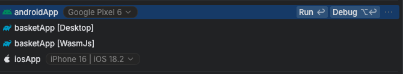

# Basket Scan and Go

## Libraries used
- 🧩 [Compose Multiplatform](https://github.com/JetBrains/compose-multiplatform); for shared UI
- 🌐 [Ktor](https://github.com/ktorio/ktor); for networking
- 📦 [Kotlinx Serialization](https://github.com/Kotlin/kotlinx.serialization); for content negotiation
- 🕰️ [Kotlinx Datetime](https://github.com/Kotlin/kotlinx-datetime); for datetime
- ... TBD

## Run instructions

### Fleet

Open Run Config action:

or you can run it from file `.fleet/run.json`

### IntelliJ IDEA
TBD

### Gradle
| platform | gradle command                                                                                                                      |
|----------|-------------------------------------------------------------------------------------------------------------------------------------|
| android  | `TBD`                                                                                                 |
| ios      | `/Applications/Xcode.app/Contents/Developer/usr/bin/xcodebuild -project app/ios/ios.xcodeproj -scheme ComposeApp -configuration Debug` |
| desktop  | `./gradlew :composeApp:desktopRun -DmainClass=com.basket.sample.scango.DesktopAppKt`                                                                                                        |
| js       | `./gradlew :composeApp:jsBrowserDevelopmentRun`                                                                                        |
| wasm     | `./gradlew :composeApp:wasmJsBrowserDevelopmentRun`

## Showcase
TBD
### Android
### iOS
### Desktop
### Web (Js & WasmJs)
