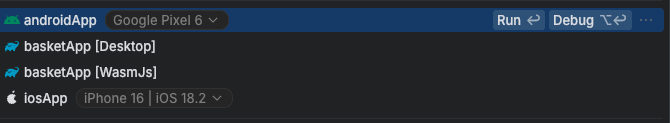
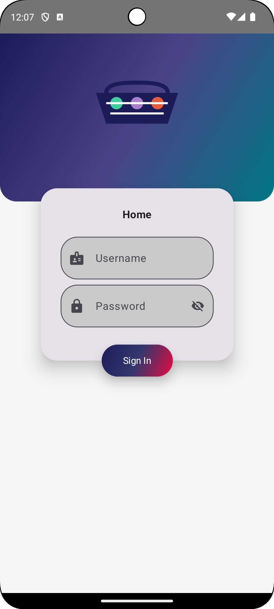
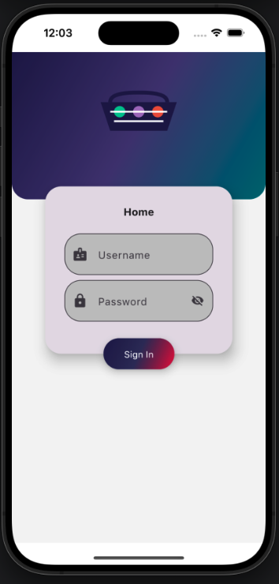
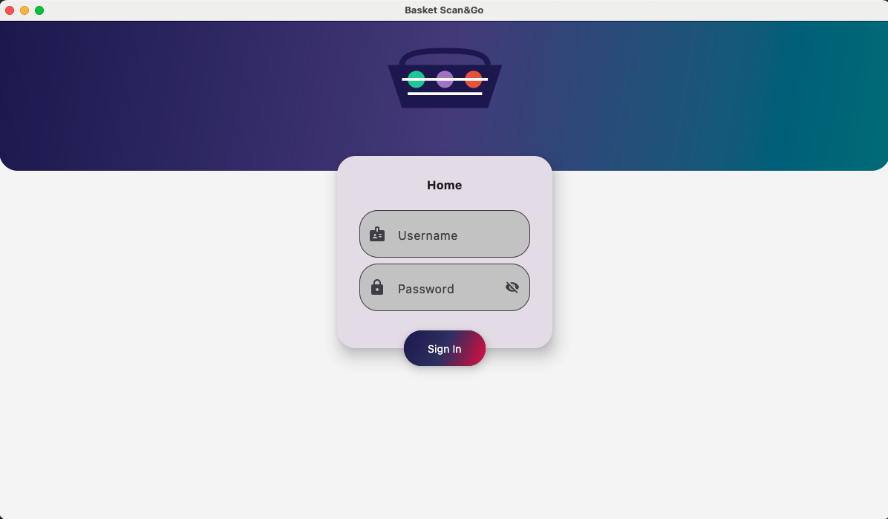
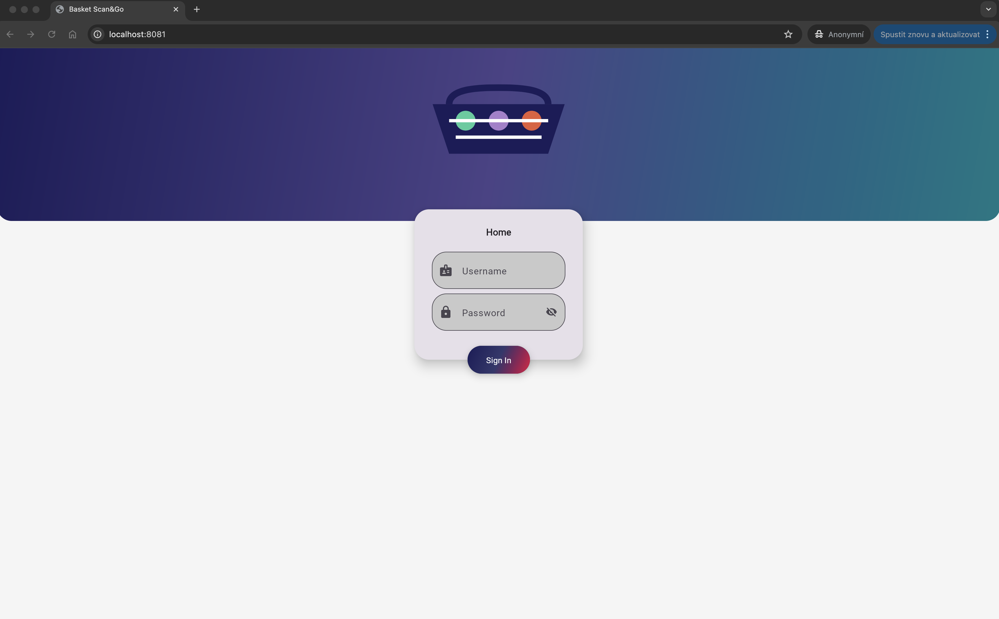

# Basket Scan and Go

[](https://kotlinlang.org)
[](https://www.jetbrains.com/lp/compose-multiplatform/)
[](https://developer.android.com/build)
[](https://gradle.org)


## Project Overview

Basket Scan and Go is a cross-platform shopping application that allows customers to scan products, add them to a virtual basket, and check out without waiting in line. The application is built using Kotlin Multiplatform and Compose Multiplatform, enabling a shared codebase across Android, iOS, Desktop, and Web platforms.

### Key Features

- **Product Scanning**: Scan product barcodes to add items to your basket
- **Basket Management**: Create, view, and modify shopping baskets
- **User Authentication**: Secure login and user management
- **Shared Baskets**: Option to share baskets with other users
- **Cross-Platform**: Works on Android, iOS, Desktop, and Web

## Libraries used
- 🧩 [Compose Multiplatform](https://github.com/JetBrains/compose-multiplatform); for shared UI
- 🌐 [Ktor](https://github.com/ktorio/ktor); for networking
- 📦 [Kotlinx Serialization](https://github.com/Kotlin/kotlinx.serialization); for content negotiation
- 🕰️ [Kotlinx Datetime](https://github.com/Kotlin/kotlinx-datetime); for datetime
- 🧹 [ktlint](https://github.com/pinterest/ktlint); for Kotlin linting and formatting
- 🔄 [Kotlin Coroutines](https://github.com/Kotlin/kotlinx.coroutines); for asynchronous programming
- 💉 [Koin](https://insert-koin.io/); for dependency injection

## Development Setup

### Server IP Configuration

When developing with a mobile device or switching networks, you need to update the server IP address in the client configuration. Helper scripts are provided in the `scripts/` folder to automate this:

**macOS/Linux:**
```bash
./scripts/update-server-ip.sh
```

**Windows:**
```cmd
scripts\update-server-ip.bat
```

These scripts will:
1. Auto-detect your machine's current IP address
2. Update the client configuration file (`BasketApiServerPathProviderImpl.kt`)

> **Note:** The server is configured to listen on `0.0.0.0` (all network interfaces), so it's accessible from any device on the same network.

## Run Instructions

### IntelliJ IDEA / Android Studio

The project includes pre-configured run configurations in `.idea/runConfigurations/`. After opening the project, you'll find these configurations in the Run/Debug dropdown:

| Configuration | Task | Description |
|---------------|------|-------------|
| **Android App** | `:apps:androidApp:installDebug` | Run Android app on device/emulator |
| **Desktop App** | `:apps:desktopApp:run` | Run desktop JVM application |
| **Web WASM App** | `:apps:webApp:wasmJsBrowserDevelopmentRun` | Run WasmJS app in browser |
| **Build All** | `build` | Build all modules |
| **Ktlint Check** | `ktlintCheck` | Run ktlint code style check |
| **iOS Framework** | `:apps:shared:embedAndSignAppleFrameworkForXcode` | Build iOS framework for Xcode |
| **Server** | `:basket-server:run` | Run the Ktor backend server |

### Fleet

Open Run Config action:

or you can run it from file `.fleet/run.json`

### Gradle Commands

| Platform | Gradle Command |
|----------|----------------|
| Android | `./gradlew :apps:androidApp:installDebug` |
| Desktop | `./gradlew :apps:desktopApp:run` |
| Web (WasmJS) | `./gradlew :apps:webApp:wasmJsBrowserDevelopmentRun` |
| iOS Framework | `./gradlew :apps:shared:linkDebugFrameworkIosSimulatorArm64` |
| Server | `./gradlew :basket-server:run` |
| Build All | `./gradlew assemble` |

## Code Quality

### ktlint

This project uses [ktlint](https://github.com/pinterest/ktlint) for Kotlin code style checking and formatting. ktlint is a linter with built-in formatter that enforces the official Kotlin code style.

#### Available Gradle tasks

- `./gradlew ktlintCheck` - Run ktlint check on all modules
- `./gradlew ktlintFormat` - Run ktlint format on all modules to automatically fix style violations
- `./gradlew <module>:ktlintCheck` - Run ktlint check on a specific module
- `./gradlew <module>:ktlintFormat` - Run ktlint format on a specific module

#### IDE Integration

For IntelliJ IDEA / Android Studio, you can install the [ktlint plugin](https://plugins.jetbrains.com/plugin/15057-ktlint-unofficial-) to get real-time linting and formatting.

## Architecture

### Architectural Dependency Map

The application follows Clean Architecture principles with a clear separation of concerns:

```
┌─────────────────────────────────────────────────────────────────┐
│                        PRESENTATION LAYER                       │
│                                                                 │
│  ┌─────────────────┐  ┌─────────────────┐  ┌─────────────────┐  │
│  │   ViewModels    │  │  Screen States  │  │     Events      │  │
│  └────────┬────────┘  └─────────────────┘  └─────────────────┘  │
│           │                                                     │
└───────────┼─────────────────────────────────────────────────────┘
            │
            ▼
┌─────────────────────────────────────────────────────────────────┐
│                          DOMAIN LAYER                           │
│                                                                 │
│  ┌─────────────────┐  ┌─────────────────┐  ┌─────────────────┐  │
│  │    Use Cases    │  │ Domain Models   │  │  Repositories   │  │
│  │    Interface    │  │                 │  │   Interface     │  │
│  └────────┬────────┘  └─────────────────┘  └────────┬────────┘  │
│           │                                         │           │
└───────────┼─────────────────────────────────────────┼───────────┘
            │                                         │
            ▼                                         ▼
┌─────────────────────────────────────────────────────────────────┐
│                           DATA LAYER                            │
│                                                                 │
│  ┌─────────────────┐  ┌─────────────────┐  ┌─────────────────┐  │
│  │ Repository Impl │  │   Data Sources  │  │    DTOs/APIs    │  │
│  └────────┬────────┘  └────────┬────────┘  └────────┬────────┘  │
│           │                    │                    │           │
└───────────┼────────────────────┼────────────────────┼───────────┘
            │                    │                    │
            ▼                    ▼                    ▼
┌─────────────────────────────────────────────────────────────────┐
│                        PLATFORM LAYER                           │
│                                                                 │
│  ┌─────────────────┐  ┌─────────────────┐  ┌─────────────────┐  │
│  │     Result      │  │     KLogger     │  │      KTime      │  │
│  └─────────────────┘  └─────────────────┘  └─────────────────┘  │
│                                                                 │
└─────────────────────────────────────────────────────────────────┘
```

### Module Dependencies

```
apps/
├── shared (KMP Shared Code - Compose UI)
│   ├── core/presentation
│   └── core/di
│
├── androidApp (Android Application)
│   └── apps/shared
│
├── desktopApp (Desktop JVM Application)
│   └── apps/shared
│
└── webApp (WasmJS Web Application)
    └── apps/shared

core/
├── designSystem (UI Components & Theme)
│
├── di (Dependency Injection)
│   ├── core/logic/presentation
│   ├── core/logic/data
│   └── platform/ktime
│
└── logic/
    ├── presentation (ViewModels, States)
    │   ├── core/logic/domain
    │   ├── core/logic/data
    │   ├── core/designSystem
    │   └── platform/klogger
    │
    ├── domain (Use Cases, Models)
    │   ├── platform/result
    │   └── platform/klogger
    │
    └── data (Repositories, Data Sources)
        ├── core/logic/domain
        └── platform/klogger

platform/
├── klogger (Logging utilities)
│   └── platform/ktime
├── ktime (Date and time utilities)
└── result (Result monad for error handling)
    └── platform/ktime
```

### Detailed Module Dependency Map

The following diagram shows a more detailed view of module dependencies in the project:

```
+---------------------+     +---------------------+     +---------------------+
|        APPS         |     |        CORE         |     |        LOGIC        |
|       MODULES       |     |       MODULES       |     |       MODULES       |
+---------------------+     +---------------------+     +---------------------+
| :apps:shared        |     | :designSystem       |     | :presentation       |
| (KMP Shared UI)     |     | (UI Components)     |     | (ViewModels, States)|
|                     |     |                     |     |                     |
| :apps:androidApp    |     | :di                 |     | :domain             |
| (Android App)       |     | (Dependency         |     | (Use Cases, Models) |
|                     |     |  Injection)         |     |                     |
| :apps:desktopApp    |     |                     |     | :data               |
| (Desktop JVM App)   |     |                     |     | (Repositories,      |
|                     |     |                     |     |  Data Sources)      |
| :apps:webApp        |     |                     |     |                     |
| (WasmJS Web App)    |     |                     |     |                     |
|                     |     |                     |     |                     |
| :basket-server      |     |                     |     |                     |
| (Ktor Backend)      |     |                     |     |                     |
+---------------------+     +---------------------+     +---------------------+
        |  |                       |   |                      |   |   |
        |  |                       |   |                      |   |   |
        |  +---------------------->+   |                      |   |   |
        |                          |   |                      |   |   |
        |  +---------------------->+   |                      |   |   |
        |  |                       |   +--------------------->+   |   |
        |  |                       |                          |   |   |
        |  |                       +------------------------->+   |   |
        |  |                                                  |   |   |
        +--+------------------------------------------------->+   |   |
           |                                                  v   v   v
           |                                          +---------------------+
           |                                          |      PLATFORM       |
           |                                          |       MODULES       |
           |                                          +---------------------+
           |                                          | :klogger            |
           |                                          | (Logging utilities) |
           |                                          |                     |
           |                                          | :ktime              |
           +----------------------------------------->| (Date and time      |
                                                      |  utilities)         |
                                                      |                     |
                                                      | :result             |
                                                      | (Result monad for   |
                                                      |  error handling)    |
                                                      +---------------------+

Dependencies:
- apps:androidApp -> apps:shared
- apps:desktopApp -> apps:shared
- apps:webApp -> apps:shared
- apps:shared -> presentation, di
- di -> presentation, data, ktime
- presentation -> domain, data, designSystem, klogger
- domain -> result, klogger
- data -> domain, klogger
- klogger -> ktime
- result -> ktime
```

This diagram illustrates:
1. **Apps Modules**: Platform-specific entry points (Android, Desktop, Web) depending on shared KMP code
2. **Core Modules**: Shared UI components and dependency injection
3. **Logic Modules**: Business logic implementation following Clean Architecture
4. **Platform Modules**: Utility modules used across the application

The arrows indicate dependencies between modules, showing how they rely on each other.

### Key Components

1. **Apps Modules** (`apps/`):
   - **shared**: KMP module with shared Compose UI code for all platforms
   - **androidApp**: Android application entry point
   - **desktopApp**: Desktop JVM application entry point
   - **webApp**: WasmJS web application entry point

2. **Core Modules** (`core/`):
   - **designSystem**: UI components and styling
   - **di**: Dependency injection setup with Koin
   - **logic**: Business logic implementation
     - **data**: Repositories and data sources (Ktor client)
     - **domain**: Use cases and domain models
     - **presentation**: ViewModels and UI state management

3. **Platform Modules** (`platform/`):
   - **klogger**: Logging utilities
   - **ktime**: Date and time utilities
   - **result**: Result monad for error handling

4. **Server Module** (`server/`):
   - **basket-server**: Ktor-based backend server implementation ([documentation](doc/basket-server.md))

5. **iOS App** (`iosApp/`):
   - Native iOS app using the shared framework from `apps:shared`

## Commit Analysis and User Impact Summary

### Recent Development Activity

```
┌────────────────────────────────────────────────────────────┐
│                                                            │
│  Commit Frequency                                          │
│                                                            │
│  15 ┼                                 ╭─╮                  │
│     │                                 │ │                  │
│  12 ┼                                 │ │                  │
│     │                                 │ │                  │
│   9 ┼                        ╭────╮   │ │                  │
│     │                        │    │   │ │                  │
│   6 ┼              ╭─╮       │    │   │ │    ╭─╮          │
│     │              │ │       │    │   │ │    │ │          │
│   3 ┼        ╭─╮   │ │   ╭─╮ │    │   │ │    │ │    ╭─╮   │
│     │        │ │   │ │   │ │ │    │   │ │    │ │    │ │   │
│   0 ┼────────┴─┴───┴─┴───┴─┴─┴────┴───┴─┴────┴─┴────┴─┴───│
│       Jan     Feb   Mar   Apr  May  Jun   Jul   Aug   Sep  │
│                                                            │
└────────────────────────────────────────────────────────────┘
```

### User Impact Analysis

The Basket Scan and Go application provides significant benefits to users:

1. **Time Savings**: Users can scan products as they shop and skip checkout lines
2. **Convenience**: Easy basket management and sharing capabilities
3. **Cross-Platform Access**: Use the same application across different devices
4. **Real-time Updates**: Immediate product and price information

### Development Focus Areas

```
┌──────────────────────────────────────────────────────────┐
│                                                          │
│  Feature Development Distribution                        │
│                                                          │
│  UI/UX Improvements ███████████████████████ 35%          │
│  Basket Management  ██████████████████ 27%               │
│  Authentication     ███████████ 16%                      │
│  Cross-Platform     ████████ 12%                         │
│  Performance        ██████ 10%                           │
│                                                          │
└──────────────────────────────────────────────────────────┘
```

## Showcase

Below are screenshots of the Basket Scan and Go application running on different platforms.

### Android


### iOS


### Desktop


### Web (Js & WasmJs)

