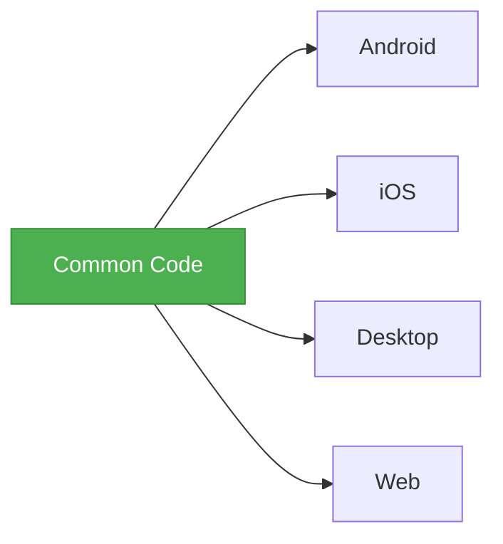

# 🛒 Basket Scan and Go - Developer Guidelines

> This document provides essential information for developers working on the Basket Scan and Go project.

---

## 📂 Project Structure

The project follows a modular architecture with clean separation of concerns:

### 📱 Main Modules

| Module | Description |
|--------|-------------|
| **composeApp** | Main UI implementation using Compose Multiplatform |
| **iosApp** | iOS-specific implementation |
| **server/basket-server** | Backend server implementation |

### 🧩 Core Modules

| Module | Description |
|--------|-------------|
| **core/logic/presentation** | ViewModels and UI state management |
| **core/logic/domain** | Business logic, use cases, and domain models |
| **core/logic/data** | Repositories and data sources |
| **core/designSystem** | UI components and styling |
| **core/di** | Dependency injection setup |

### ⚙️ Platform Modules

| Module | Description |
|--------|-------------|
| **platform/klogger** | Logging utilities |
| **platform/ktime** | Date and time utilities |
| **platform/result** | Result monad for error handling |

---

## 🏗️ Architecture

The project follows Clean Architecture principles with four main layers:

```
┌─────────────────────────────────────────┐
│           Presentation Layer            │
│  ViewModels, Screen States, Events      │
└───────────────────┬─────────────────────┘
                    ▼
┌─────────────────────────────────────────┐
│              Domain Layer               │
│  Use Cases, Domain Models, Repositories │
└───────────────────┬─────────────────────┘
                    ▼
┌─────────────────────────────────────────┐
│               Data Layer                │
│  Repository Impls, Data Sources, DTOs   │
└───────────────────┬─────────────────────┘
                    ▼
┌─────────────────────────────────────────┐
│             Platform Layer              │
│  Result, KLogger, KTime                 │
└─────────────────────────────────────────┘
```

---

## 🛠️ Tech Stack

| Technology | Purpose |
|------------|---------|
| **Kotlin Multiplatform** | Cross-platform code sharing |
| **Compose Multiplatform** | Shared UI across platforms |
| **Ktor** | Networking |
| **Kotlinx Serialization** | Data serialization |
| **Kotlinx Datetime** | Date/time handling |
| **Koin** | Dependency injection |
| **Kotlin Coroutines** | Asynchronous programming |

---

## 🚀 Development Workflow

### 🔧 Setting Up the Project

```bash
# 1. Clone the repository
git clone https://github.com/your-org/BasketScanAndGo.git

# 2. Navigate to project directory
cd BasketScanAndGo

# 3. Let Gradle sync to download dependencies
./gradlew --refresh-dependencies
```

### 🏃‍♂️ Running the Application

<details>
<summary><b>🛠️ Using Fleet</b></summary>
<p>

Open Run Config action or use the file `.fleet/run.json`


</p>
</details>

<details>
<summary><b>⚙️ Using Gradle</b></summary>
<p>

| Platform | Command |
|----------|---------|
| **Android** | TBD |
| **iOS** | `/Applications/Xcode.app/Contents/Developer/usr/bin/xcodebuild -project app/ios/ios.xcodeproj -scheme ComposeApp -configuration Debug` |
| **Desktop** | `./gradlew :composeApp:desktopRun -DmainClass=com.basket.sample.scango.DesktopAppKt` |
| **JS** | `./gradlew :composeApp:jsBrowserDevelopmentRun` |
| **WASM** | `./gradlew :composeApp:wasmJsBrowserDevelopmentRun` |

</p>
</details>

### 🧪 Testing

The project uses Kotlin's standard testing library (`kotlin.test`) for unit tests.

```kotlin
// Sample test
class SampleTest {
    @Test
    fun testSomething() {
        val result = someFunction()
        assertEquals(expected, result)
    }
}
```

| Test Type | Command | Description |
|-----------|---------|-------------|
| **All Tests** | `./gradlew test` | Run all tests in the project |
| **Platform-specific** | `./gradlew <platform>Test` | e.g., `./gradlew jvmTest` |
| **Single Module** | `./gradlew :<module>:test` | Run tests for specific module |

### 🧹 Code Quality

The project uses [ktlint](https://github.com/pinterest/ktlint) for code style checking and formatting:

| Task | Command | Description |
|------|---------|-------------|
| **Check code style** | `./gradlew ktlintCheck` | Check all modules |
| **Format code** | `./gradlew ktlintFormat` | Format all modules |
| **Check specific module** | `./gradlew <module>:ktlintCheck` | Check single module |
| **Format specific module** | `./gradlew <module>:ktlintFormat` | Format single module |

---

## 💡 Best Practices

### 📊 Code Organization

<table>
<tr>
<td width="60"></td>
<td><b>Follow Clean Architecture</b>: Respect the separation between presentation, domain, and data layers</td>
</tr>
<tr>
<td></td>
<td><b>Use Domain Models</b>: Don't expose DTOs to the presentation layer</td>
</tr>
<tr>
<td></td>
<td><b>Keep UI Stateless</b>: UI should render based on state from ViewModels</td>
</tr>
</table>

### 🌐 Multiplatform Development



| Principle | Description |
|-----------|-------------|
| **Maximize Common Code** | Put as much logic as possible in commonMain |
| **Platform-Specific Code** | Use expect/actual for platform-specific implementations |
| **Test on All Platforms** | Ensure your changes work across all target platforms |

### ⚡ Performance

> **Performance Tips**: Follow these guidelines to ensure your app runs smoothly across all platforms.

- ⏱️ **Use Coroutines**: For asynchronous operations
- 🚫 **Avoid Blocking Operations**: Especially in the UI thread
- 🔋 **Optimize Resource Usage**: Be mindful of memory and battery usage

### 🔄 Git Workflow

<div align="center">

</div>

```
main
 ├── feature/user-authentication
 │    └── PR: Implement user login
 ├── feature/basket-management
 │    └── PR: Add product scanning
 └── fix/crash-on-checkout
      └── PR: Fix NPE during checkout
```

1. 🌿 **Feature Branches**: Create a branch for each feature or bug fix
2. 📝 **Descriptive Commits**: Write clear commit messages
3. 🔍 **Pull Requests**: Submit PRs for code review before merging

---

## 🔧 Troubleshooting

<details>
<summary><b>🛠️ Common Build Issues</b></summary>
<p>

```bash
# Clean the project
./gradlew clean

# Invalidate caches (in IntelliJ IDEA)
# File > Invalidate Caches / Restart...
```

</p>
</details>

<details>
<summary><b>💾 Gradle Memory Issues</b></summary>
<p>

If you encounter Out of Memory errors, adjust memory settings in `gradle.properties`:

```properties
# Increase memory for Gradle
org.gradle.jvmargs=-Xmx4G -XX:MaxMetaspaceSize=1G
```

</p>
</details>

<details>
<summary><b>⏳ IDE Performance</b></summary>
<p>

- Be patient during initial indexing, especially for large projects
- Disable unused plugins to improve performance
- Consider using Fleet for better performance with large KMP projects

</p>
</details>

---

<div align="center">
<p>📱 Happy coding! 🚀</p>
</div>
